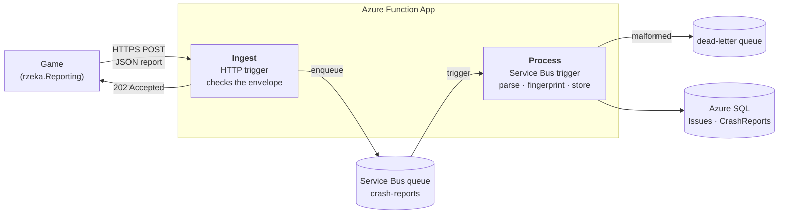

# rzeka-reporting-azure

An Azure backend that collects crash reports from games built with
[rzeka](https://github.com/eternalgarden/rzeka), a reactive event bus for C# that tracks
causality. When a spell (rzeka's name for a stream transformation) fails in a player's game,
its report arrives here with the **causal story** of the failure: which events led to it, which
parts of the game produced them, and when. Identical failures are grouped into **issues**
(rows of an `Issues` table in the database).

The client side lives in the rzeka repository as the optional package
`EternalGarden.Rzeka.Reporting`. It knows nothing about Azure: it sends JSON to an HTTP
endpoint.

Built as a learning project, with an AI assistant as pair programmer.

## Architecture



1. **Ingest** (`src/.../Ingest/`) accepts `POST /api/reports`, checks size (≤ 64 KB), JSON,
   `schemaVersion` and `reportId`, puts the report on the queue and answers `202 Accepted`. 
2. **Process** (`src/.../Process/`) parses the full report. A malformed report goes straight
   to the dead-letter queue with the reason. Otherwise it computes the report's
   **fingerprint** and stores it.
3. **Database** (`src/.../Database/`, EF Core): each report is a row in `CrashReports`; 
   reports with the same fingerprint share a row in `Issues`, which counts them and records
   when they were first and last seen. A report delivered twice is stored once.

The reasons behind the main decisions are recorded as ADRs:

- [0001 Queue between ingest and processing](docs/adr/0001-queue-between-ingest-and-processing.md)
- [0002 Structure-only reports and player consent](docs/adr/0002-structure-only-reports-and-player-consent.md)
- [0003 Client-generated report ID](docs/adr/0003-client-generated-report-id.md)

### The report

The payload contract is [`contract/crash-report.v1.sample.json`](contract/crash-report.v1.sample.json).
Client and backend have their own C# types for it and test against this same file, so the
JSON is the contract, not a shared library. `schemaVersion` lets the format evolve.

### Grouping: the fingerprint

Reports are grouped by a SHA-256 of a readable **canonical string** built from the failing
spell (school, title, owner type), the exception type and the top three stack frames of the
game's own code. Line numbers, file names, compiler-generated numbering (`b__3_0`) and
framework frames are removed, so the same bug groups across builds, code edits and library
upgrades. Example:

```
v1|Looming|Looming of DamageTaken into HealthChanged|Health|System.InvalidOperationException|Health.Apply(DamageTaken damage)
```

The canonical string is stored with each issue, to show *why* reports were grouped. See
`src/.../Process/Fingerprint.cs` and its tests.

## Privacy

Crash reporting is **off until the player agrees**, and reports contain **structure, never
values**:

- matter appears only as type names, IDs and causal links; spells as titles and owner types;
- exception messages are scrubbed (paths, quoted text, emails, URLs, long numbers) or omitted;
- stack traces keep file names but lose directories;
- times are UTC; the OS is sent as a family only.

Details and trade-offs: [ADR 0002](docs/adr/0002-structure-only-reports-and-player-consent.md).

## Security notes

- **Ingest is a public endpoint by design.** A function key is required, but a key shipped in
  a game can be extracted, and for an open-source game it must never be committed: inject it
  at build time instead (from a CI secret, or a gitignored local config file during
  development).
- What protects the backend is on the server side: the size limit (64 KB, while real reports
  are 1.5–2.5 KB; it also keeps every message well under Service Bus's 256 KB maximum),
  validation of every report, and dead-lettering of anything malformed.
- Secrets (Service Bus and SQL connection strings) live in the Function App's settings and in
  a gitignored `local.settings.json`, never in the repository.
- Not yet in place: rate limiting, managed identity instead of connection strings, private
  network access to the database. See the [roadmap](docs/ROADMAP.md).

## Running it

### Prerequisites

- .NET 10 SDK (the backend targets .NET 10; the client package targets .NET 8, like rzeka and
  Godot 4)
- Azure Functions Core Tools v4 (`func`) and Azurite
  (`npm i -g azure-functions-core-tools@4 azurite`)
- An Azure subscription with a Service Bus namespace (queue `crash-reports`) and an Azure SQL
  database. There are no local emulators in this setup: local runs use the real queue and
  database.

### Tests

```sh
dotnet test
```

Unit tests cover envelope validation, report parsing, the fingerprint rules and the database
logic (against SQLite in memory).

### Locally

```sh
cp src/RzekaReporting.Functions/local.settings.sample.json src/RzekaReporting.Functions/local.settings.json
# fill in ServiceBusConnection and SqlConnection

SqlConnection="<sql connection string>" dotnet ef database update --project src/RzekaReporting.Functions

azurite --silent --location ~/.azurite &
cd src/RzekaReporting.Functions && func start
```

Then send the sample report:

```sh
curl -i -X POST localhost:7071/api/reports -H "Content-Type: application/json" \
  --data-binary @contract/crash-report.v1.sample.json
```

### In Azure

The resources, all in one resource group (region used here: Germany West Central):

| Resource | Purpose |
|---|---|
| Service Bus namespace (Basic tier) + queue `crash-reports` | between Ingest and Process |
| Azure SQL server + database (free offer, serverless) | issues and reports |
| Storage account | the Function App's own state and code package |
| Function App (Flex Consumption, .NET 10 isolated) | runs Ingest and Process |

After creating them, set the `ServiceBusConnection` and `SqlConnection` app settings, apply
the migration as above, and deploy with `func azure functionapp publish <app-name>`.

A real rzeka failure can be sent with the demo in the rzeka repository:

```sh
RZEKA_REPORTS_URL='https://<app>.azurewebsites.net/api/reports?code=<key>' \
  dotnet run --project samples/CrashReportDemo
```

It sends three reports that end up as two issues.

## What's intentionally missing

This is a first version, built in a week. Not included, on purpose:

- a way to **read** reports other than querying the database (a read API is the first
  roadmap item);
- client-side buffering of reports while offline;
- rate limiting, managed identity and private networking;
- infrastructure as code and automated deployment (resources were created with the `az` CLI).

Everything planned is in [docs/ROADMAP.md](docs/ROADMAP.md).
